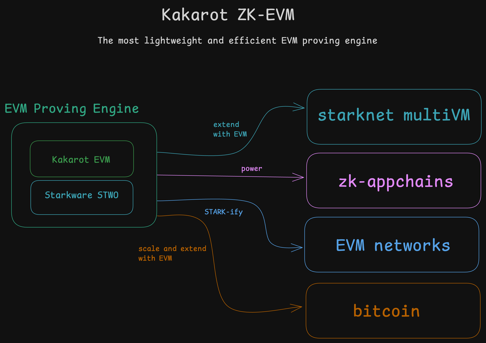
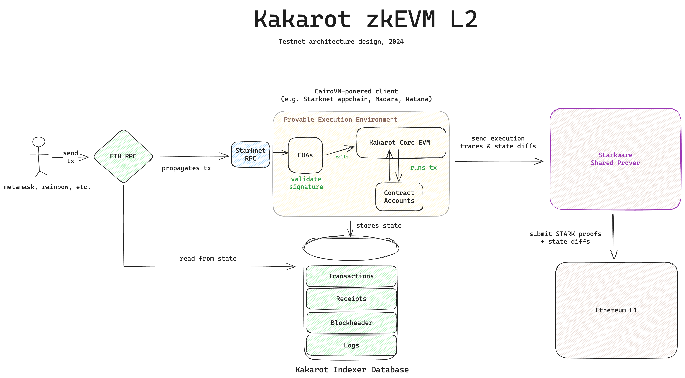
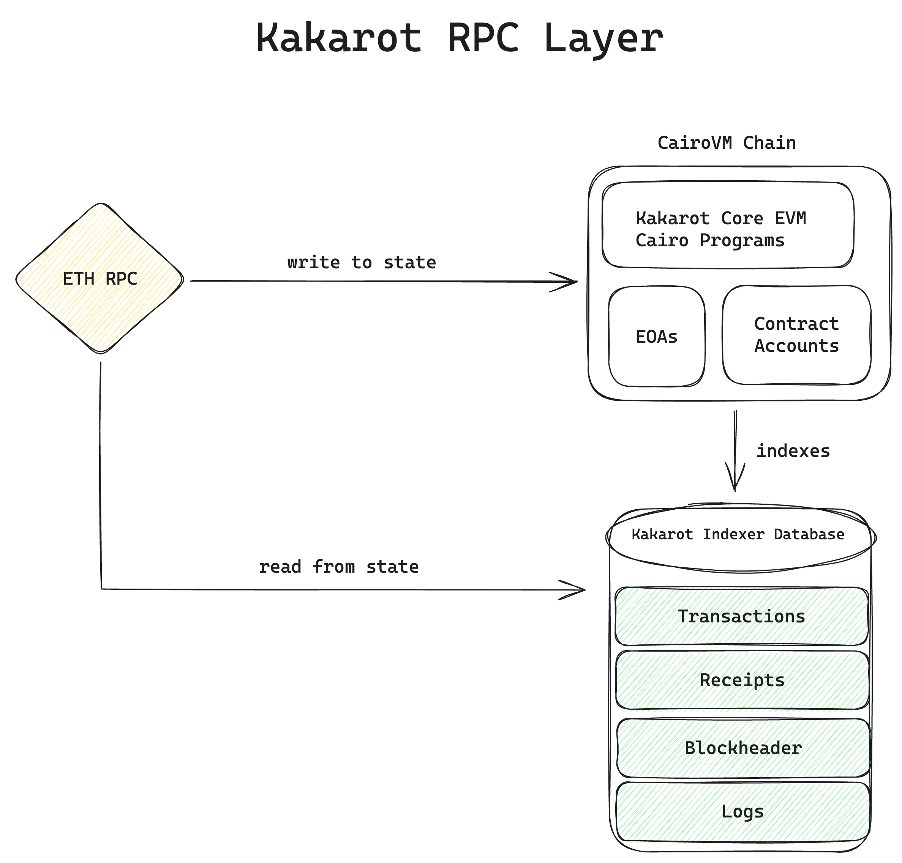
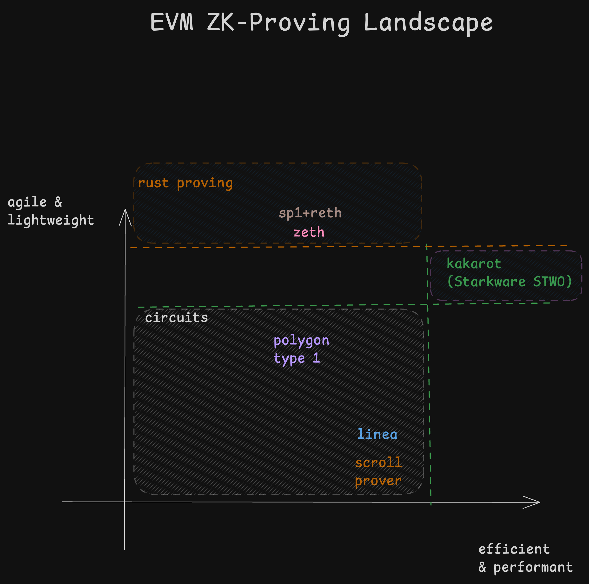
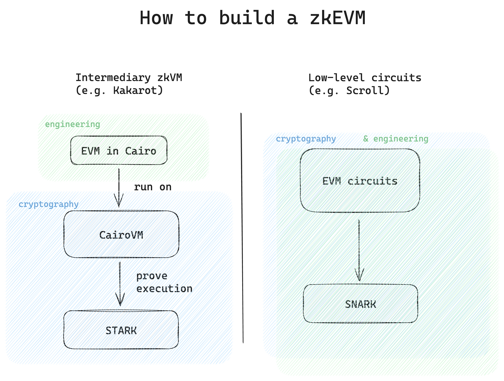

## Kakarot, the EVM proving engine built in Cairo

Kakarot is a provable EVM built on the
[Cairo ZK-VM](https://www.cairo-lang.org/), Starkware's turing complete and
efficient ZK-VM.

The natural first use case for Kakarot is to be embedded into Starknet, thus
making it a MultiVM environment. Starknet effectively becomes EVM compatible;
allowing the use of both CairoVM and EVM for builders & users. Additionally,
Kakarot Labs
[strives to push more innovations](https://ethcc.io/archive/Kakarot-zkEVM-beyond-ethereum-compatibility)
to the L2 space, participating in governance initiative such as
[Rollup Improvement Proposals](https://github.com/ethereum/RIPs) (RIPs) and
[Rollcall](https://github.com/ethereum/pm/issues/1071#issuecomment-2221171582).

For the Starknet community, Kakarot removes any kind of EVM-compatibility
barrier to developers seeking to take advantage of Starknet’s scalability. For
the broader Ethereum ecosystem, Kakarot accelerates the adoption of provable
compute.

For developers on Starknet, this means being able to use EVM programming
languages and tools in addition to existing tools on Starknet, therefore vastly
expanding their options. Additionally, developers who want to launch an EVM
appchain (a chain tailored to their specific app) with Kakarot benefit from the
stack being highly auditable, maintainable, and modular!

For EVM native users, this means both access to faster and cheaper transactions
on Starknet, as well as better interoperability with the broader Ethereum
ecosystem.

Discover the Kakarot explorer and other useful links on the
[survival guide](../survival-guide) page.

## Kakarot is not a rollup

- Kakarot is not an appchain or a blockchain. Kakarot Labs is deploying an EVM
  environment on Starknet Mainnet. This EVM environment is fully enshrined &
  embedded into Starknet L2. Kakarot transactions and blocks are abstractions
  over Starknet transactions and block under the hood.
- Kakarot is not an L3, nor an L2. Kakarot Labs is launching an EVM runtime
  inside Starknet. Long-term, Kakarot Labs will rename the Kakarot initiative on
  Starknet: "Starknet EVM" to reduce confusion.
- Kakarot is not privacy preserving. Zero-knowledge technologies can be used for
  two (non-excluding) purposes, Scaling or Privacy. The underlying proof system
  used by Cairo is not privacy-preserving.

## How does Kakarot work under the hood?

### Kakarot is an implementation of the EVM in Cairo

Under the hood, Kakarot's core EVM is an implementation of the EVM instruction
set in Cairo.

> Cairo is the first Turing-complete language for creating provable programs for
> general computation.

Cairo is like any a programming language, but made for writing provable
software. It means that whatever is written in Cairo is, by design, _zk_. Note
that we use the term _zk_ here in the sense that execution of provable software
is "ZK-verifiable", not that it is privacy preserving, or so-called
"zero-knowledge". Using Cairo means that we leverage the power of STARKs without
having to think about it, it sort of "comes for free" just by using this
language and not another high-level language, such as Rust or Python.

---

Diagram - Kakarot on Starknet high-level architecture:

---

Kakarot on Starknet is composed of three parts: the Core EVM in Cairo, an RPC
layer (RPC server and EVM indexer) and an underlying host CairoVM client (e.g.
Starknet mainnet).

### Kakarot runs on an underlying StarknetOS client

Kakarot's core EVM is deployed on Starknet. The core EVM is running as a Cairo
smart contract on Starknet. Users only interact with Starknet MultiVM through
the RPC layer in an Ethereum-compatible way. The only exposed interface in
Kakarot is the Ethereum JSON-RPC specification. Additionally, we allow
developers to write and use Cairo modules to enhance the performance of their
apps, similarly to [Arbitrum Stylus](https://arbitrum.io/stylus).

---

Diagram - Kakarot RPC Layer

---

To put it simply, Kakarot is composed of an EVM written in Cairo and an RPC
layer to allow users to interact with it in an Ethereum format. Starknet's
allows the deployment of Cairo programs. All Cairo execution traces are provable
by design, which allows Starknet to batch blocks and submit STARK proofs of
execution to L1 using the
[Starkware Shared prover](https://starkware.co/tech-stack/) (SHARP).

In Kakarot on Starknet, the design choices regarding EVM programs and their
Cairo equivalents are explained below. They are subject to architecture changes
over time. **🎙️ Disclaimer 🎙️: all these designs choices are invisible to the
user**:

- every EVM Account, i.e. both smart contract (so-called _Contract Account_) and
  EVM user-owned account (so-called _Externally Owned Account (EOA)_) is
  deployed as a unique Starknet smart contract. This Starknet smart contract
  stores its own bytecode and EVM storage slots.
  - It has a Starknet formatted address (31 bytes hex string), which is uniquely
    mapped to its EVM address (20 bytes hex string). For the user, this is
    invisible.
  - Its native balance in ETH (coin vs. token) is denominated in Starknet's ETH
    ERC20 under the hood in the Kakarot system. For the user, this is invisible.
  - EOAs in Kakarot behave exactly like in Ethereum L1, uses the same signature
    and validation, though it can be extended in the future to support
    innovative features!
- EVM transactions that are sent by users are wrapped in Starknet transactions.
  The derived EVM Transaction hashes are mapped 1-to-1 with underlying Starknet
  transaction hashes. Since signature verification is done in a Cairo program,
  transactions are provably processed with integrity
  [despite being wrapped at the RPC level](https://github.com/kkrt-labs/kakarot-rpc).
  For the user, this is invisible.
- new state roots are computed according to
  [the state trie of Starknet](https://docs.starknet.io/architecture-and-concepts/network-architecture/starknet-state/)
  (pedersen MPT). Kakarot uses Pedersen hash and not keccak for block hash
  computation because of the zk-unfriendliness of keccak. This does not hurt EVM
  compatibility at the applicative level. Note that the transaction trie and
  receipt trie are both computed as keccak tries for the RPC layer (block
  explorers, indexers, etc.), but as pedersen tries for the STARK proof
  generation.

TL;DR - whatever is written in Cairo can be proven. Kakarot implements the EVM
specification in Cairo. It is provable by design. All the Cairo magic is done
under the hood. For the user, this is invisible. They are interacting with in an
EVM-compatible manner.

## The difference between Kakarot and other ZK-EVMs

Remember that a ZK-EVM is an EVM for which transaction execution is provable.
There are a few ways to build a ZK-EVM. An interesting axis is to check how
low-level the implementation is. When a ZK-EVM is built using zk-circuits, it is
considered to be low-level (specialized, hard to maintain & audit, historically
more performant but in reality not anymore). If it relies on a general-purpose
ZK-VM (Cairo, Risc-Zero, Jolt, etc.), it is considered high-level (agile,
sustainable and performant thanks to newer proof systems such as
[Circle STARK](https://vitalik.eth.limo/general/2024/07/23/circlestarks.html)).

Kakarot ZK-EVM is among the most high-level ZK-EVM in production. On the scale
of maths language and polynomials to human understandable language, Kakarot is
close to human readable language. This matters to users in two ways:

- Because Kakarot is built on Cairo, Kakarot as a codebase is extremely slim (an
  order of magnitude lighter than other ZK-EVMs) and thus extremely easy to
  maintain, adapt to Ethereum changes, or add new features to (e.g. native
  account abstraction).
- Cairo (through Starknet) is a vibrant ecosystem and Kakarot can benefit from
  all its innovations with ease (same underlying tech stack). Ideas on the long
  term could include parallel execution, seed-less wallets (e.g. rely on face ID
  only), Celestia DA integration and more.

TL;DR - By betting on the CairoVM for the years to come, Kakarot leverages the
entire Cairo (and thus Starknet) ecosystem. Cairo is the most advanced
high-level zk-toolbox in production, first with
[StarkEx](https://www.theblock.co/post/237064/starkex-layer-2-records-1-trillion-in-on-chain-trading-volume-since-june-2020)
and now Starknet.

TL;DR: when it comes to ZK-infrastructure, write code, not circuits.

---

Diagram - How to build a ZK-EVM:

We believe that in focusing only on engineering, our approach is scalable and
sustainable.

<!-- For information unrelated to documentation effort, link to external URLs to decrease the area to maintain: docs should contain doc-related content, and for other content (e.g. how did Kakarot start, what is the roadmap, etc.), use other media -->
