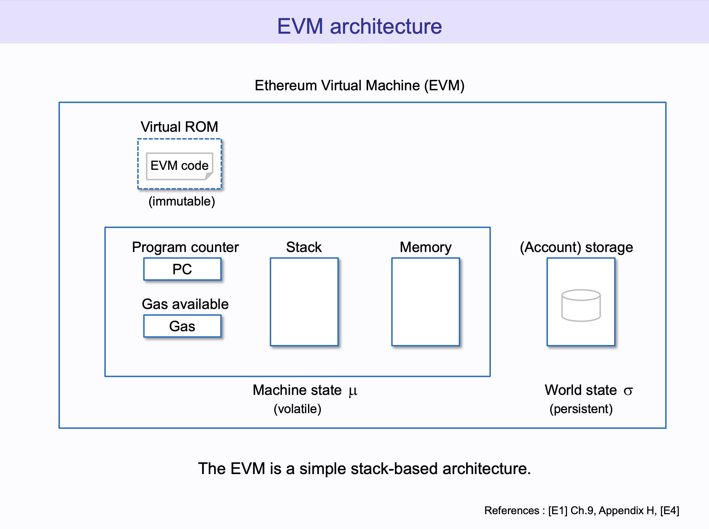

To grasp the concept of ZK-EVM, let's start by understanding what the Ethereum
Virtual Machine (EVM) is.

## The Ethereum Virtual Machine (EVM)

### EVM Overview

Starting from the
[Ethereum Foundation definition](https://ethereum.org/developers/docs/evm#from-ledger-to-state-machine):

> Ethereum's state is a large data structure which holds not only all accounts
> and balances, but a machine state, which can change from block to block
> according to a pre-defined set of rules, and which can execute arbitrary
> machine code. The specific rules of changing state from block to block are
> defined by the EVM.

From the above we get that the Ethereum blockchain is a distributed state
machine and that the
[Ethereum Virtual Machine](https://ethereum.org/developers/docs/evm) is a
software-based emulation of a physical computer (virtual machine) used to
operate (compute state transitions) this blockchain.

Note that the EVM is a deterministic execution environment.

- Deterministic meaning that a smart contract will produce the same output given
  the same input, regardless of which node in the network executes it. This is
  essential for maintaining consensus across the network.
- An execution environment i.e. where smart contracts are executed. Note that
  each Ethereum node runs an EVM instance, allowing it to participate in
  executing and validating smart contracts and transactions.
  - For instance, Ethereum Validators run both a consensus client and an
    execution client. This execution client is powered by an EVM implementation.
    That way, validators _validate_ transactions by re-running them locally
    before voting to ensure their correctness ✅!

TL;DR - the EVM is the common virtual computer used to run logic on the Ethereum
network.

### Architecture of the EVM

---

Diagram - The EVM Illustrated by Takenobu:

Source: The EVM illustrated,
https://takenobu-hs.github.io/downloads/ethereum_evm_illustrated.pdf

---

Let's use the image above from Takenobu to describe the machine architecture of
the EVM.

1. Virtual ROM: This contains the EVM code. Once smart contracts are deployed,
   their code cannot be changed (proxy pattern notwithstanding 🧑‍🔬). Smart
   contract code is said to be _immutable_ on Ethereum.

2. Program counter (PC): This keeps track of the position in the code that the
   EVM is currently executing.

3. Gas available (Gas): Each operation in the EVM requires a certain amount of
   "gas," which is a unit that measures the computational effort required. The
   gas available field tracks how much gas is left for the transaction to
   continue operating.

4. Machine state (µ): This is the volatile state of the machine which includes
   the program counter, memory, stack, and more. It is volatile because it is
   reset between transactions. It is not shared between intra-transaction calls
   (e.g. if there are 3 different contracts calls within one transaction),
   though this will change with
   [transient storage](https://eips.ethereum.org/EIPS/eip-1153).

5. Stack: The EVM is a stack-based machine, which means that it uses a data
   structure called a stack to store data. Operations in EVM code manipulate the
   stack in various ways.

6. Memory: This is a temporary place to store data during execution. It is
   volatile because it is reset between transactions or intra-transaction calls.

7. (Account) Storage: This is a long-term storage that each account in Ethereum
   has. Unlike memory, storage is persistent and remains between transactions
   and even between sessions. This includes both Account Contracts (smart
   contracts) and Externally Owned Accounts or EOAs (user accounts, like the
   account in your Metamask wallet!).

8. World State (σ): This is the persistent state of the entire Ethereum system
   which includes all accounts (no. 7) and their balances, storage, code, etc.

It's called a "stack-based" architecture because the primary mode of computation
is through a data stack, which is a last-in, first-out (LIFO) structure.

Kakarot is a ZK-EVM built in Cairo. Essentially, this means we've written number
1 to 8 in Cairo (by relying on existing StarknetOS clients as well). The
[Geth](https://geth.ethereum.org/) team has done it in Golang. The
[Reth](https://github.com/paradigmxyz/reth) team has done it in Rust. It just so
happens that Cairo is provable by design, and the EVM needs to be proven for
Ethereum to scale! How convenient 🥕.

## The concept of zk-Rollup

The zk in zk-Rollup and ZK-EVM means _zero-knowledge_. It refers to the
cryptographic method by which one party (the prover) can prove to another party
(the verifier) that a statement is true. In the case of an Kakarot ZK-EVM, the
prover (the rollup) proves to the verifier (Ethereum L1) that a batch of L2
transactions are valid. Zk-Rollups help Ethereum mainnet scale through this
concept of batches: submit less transactions to Ethereum L1, have Ethereum L1
compute less logic, lower the costs.

The integrity of these so-called batches is mathematically guaranteed by
zero-knowledge proofs (also called validity proofs when they are not privacy
preserving).

To dive deeper, you can refer to a
[high-level article about zero-knowledge proofs](https://medium.com/starkware/stark-math-the-journey-begins-51bd2b063c71),
written by the inventors of STARK proofs: Starkware.

To grasp the value of zk-Rollups, it is important to understand that when a
transaction is executed on Ethereum, all the full nodes in the network run it
locally to verify its integrity. Therefore, each transaction is executed
hundreds of thousands of times in order to guarantee the network's state. The
idea behind zk-Rollups is to run a transaction once, compute that transaction's
proof of integrity and thereafter only verify this proof without re-running the
initial transaction. Luckily for us (and the Rollup centric roadmap of
Ethereum), the verification of a transaction's proof is way cheaper than
re-running that same transaction (it is asymptotically exponentially cheaper).

From there is derived the protocols of zk-Rollups. As per the
[Ethereum website](https://ethereum.org/developers/docs/scaling/zk-rollups#what-are-zk-rollups):

> Zero-knowledge rollups (ZK-rollups) bundle (or 'roll up') transactions into
> batches that are executed off-chain. Off-chain computation reduces the amount
> of data that has to be posted to the blockchain. ZK-rollup operators submit a
> summary of the changes required to represent all the transactions in a batch
> rather than sending each transaction individually. They also produce validity
> proofs to prove the correctness of their changes.

TL;DR - execute off-chain, verify on-chain, save on costs.

## What does it mean to prove the EVM: the transition from EVM to ZK-EVM?

A ZK-EVM is simply an EVM implementation that is provable. To simplify, some
people call Ethereum-compatible ZK-Rollups "ZK-EVMs". This means that users
should be able to interact with it as if they were interacting with Ethereum (or
almost). For instance, users will use the same tools on a Ethereum-compatible
ZK-Rollup (e.g. Scroll) than on Ethereum L1, such as the same wallet (e.g.
Metamask). Developers' smart contracts should be deployable to a ZK-EVM without
any (or little) changes.

This is powerful in the sense that the cryptography and proving part is
abstracted away. Users continue to interact with a high-level abstraction
they're familiar with: the EVM. In that sense, the iterative "build on existing
work" aspect of innovation is preserved in the Ethereum ecosystem. Builders are
able to harness the scalability power of SNARKs and STARKs while being able to
write Solidity and EVM compatible smart contract languages.

Other actors in the zk-Rollup ecosystem have decided to start over and break
compatibility with the EVM. This includes for instance
[Starknet](https://www.starknet.io/en), an non-EVM compatible L2 powered by the
CairoVM. Users and developers on Starknet need to get used to using new tools
and technologies, but benefit from lower costs since Cairo is specifically built
for ZK. Kakarot places a somewhat different bet: the EVM will remain the
dominant common abstraction layer in crypto and Cairo will be the strongest
ZK-VM. Therefore, it makes sense to both:

- launch an EVM environment on Starknet in 2024, thus making it a MultiVM L2,
- bet on the Cairo powerhouse for the years to come.

Kakarot users stand to benefit both from the Ethereum network effect and the
innovations built on the most disruptive zk-toolbox: the CairoVM stack.

Note that a ZK-EVM also designates the software used to prove
Ethereum-compatible transactions and blocks. It refers to code that is used to
go from an EVM transaction to a zero-knowledge (or validity) proof. The
implementation of a ZK-EVM can be either low-level (at the so-called "circuits"
level) or high-level (use an intermediary ZK-VM). [Scroll](https://scroll.io/)
is an embodiment of the former, and Kakarot of the latter.

TL;DR: Execute Ethereum-compatible transactions on a Layer 2, prove them
off-chain, bundle and verify them on Ethereum L1. Save on costs, benefit from an
existing ecosystem: the Ethereum community.
