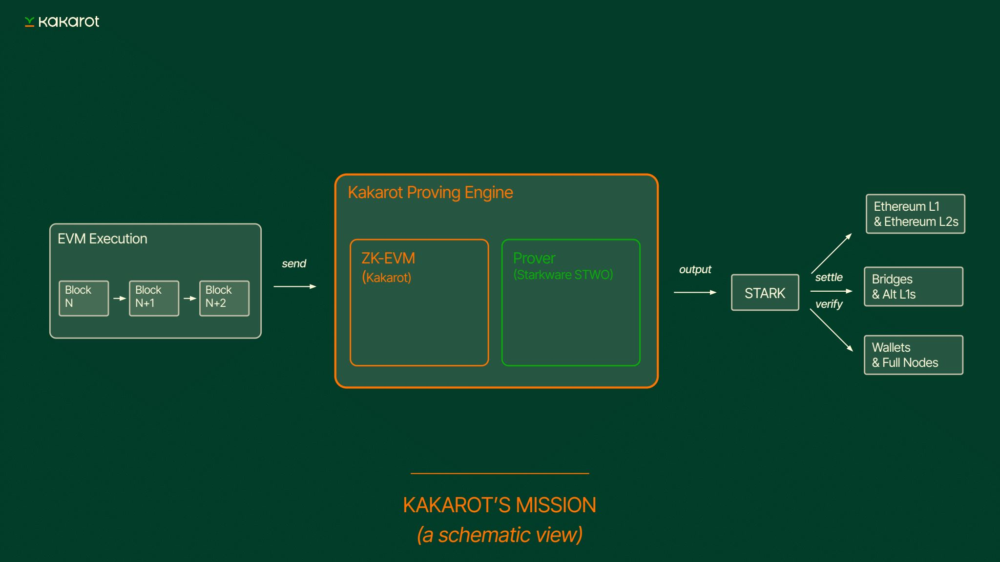

# Transition any EVM chain to ZK

Kakarot can prove blocks of Ethereum-equivalent chains, enabling any EVM chain
to transition to ZK for scalability and security. We call this service
[Keth](https://github.com/kkrt-labs/keth), a chain-agnostic EVM proving service
with real-time proof generation. We believe this brings strong value to the
broader Ethereum ecosystem: help optimistic rollups transition to ZK, reinforce
the proof system of existing ZK-rollups, power ZK bridges and ZK infrastructure
(ZK full nodes), and speed-up the adoption of ZK at the L1 level.

Keth will become a proving powerhouse, in its ability to “STARKify” every
EVM-equivalent network in the space. The first use case of Keth is to help
transition every Optimistic rollup into a ZK-rollup. Secondly, Keth will allow
currently expensive EVM ZK-rollups to adopt a cheaper and more performant prover
stack.

Lastly, **Keth will also accelerate the transition of all rollups to
[Stage 2](https://medium.com/l2beat/introducing-stages-a-framework-to-evaluate-rollups-maturity-d290bb22befe)**
as they adopt multi-proofs in their architecture, with Keth as one of the
options. Every single EVM ZK-rollup will then be able to prove its integrity
using multiple proof systems simultaneously without having to pay extremely high
proving fees (e.g., using proofs from Risc-Zero, Succinct, and Kakarot). These
multiple proof systems will work in a complementary way: all proofs will have to
agree on the state of network, ensuring no single point of failure.

For example, Taiko, an existing EVM ZK-rollup can adopt multi-proof approach
with its prover adaptor, [Raiko](https://github.com/taikoxyz/raiko) using proof
systems from Keth, Risc-Zero Zeth and Succinct’s RSP.

We believe that Keth is contributing towards a “ZK-everything” future where all
bridges, wallets, or full nodes in the rollup ecosystem are powered by ZK. This
movement will significantly reduce the cost of every major rollup infrastructure
while increasing users’ sovereignty. Indeed, with ZK, users gain the ability to
verify proofs locally, reducing the reliance on trusted infrastructure
providers.

When it comes to performance, early benchmarks have shown that Starkware STWO,
the prover technology used by Keth, could achieve tens of MHz in prover speed.
Keth is believed to bring improved performance, orders of magnitude more
efficient than existing solutions.

Keth is scheduled to go live in production by end-of-year 2025.
